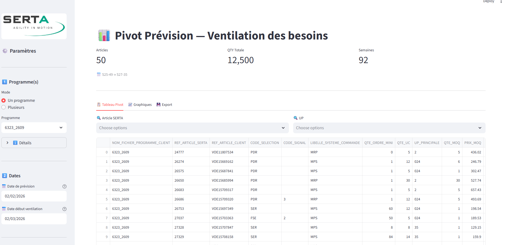
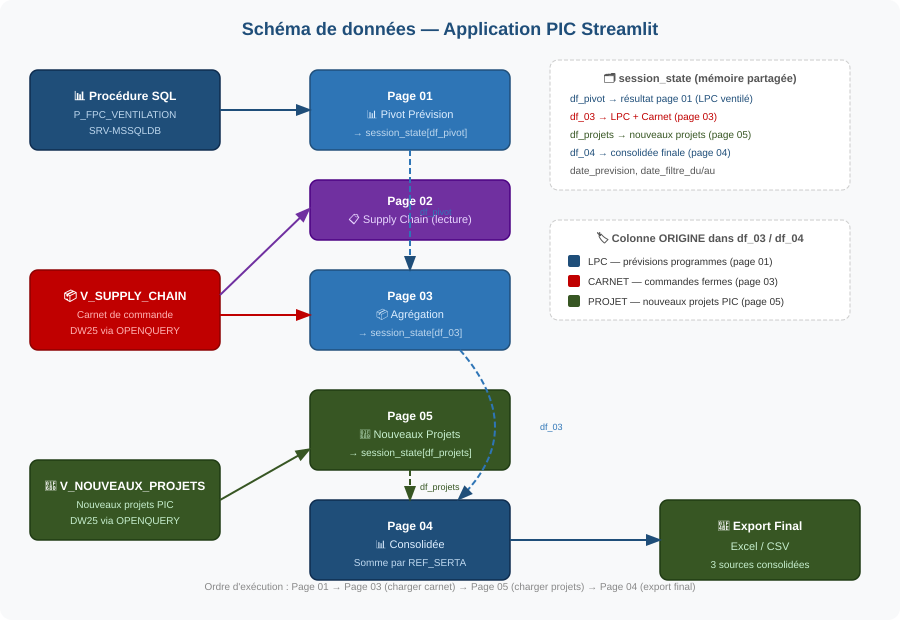
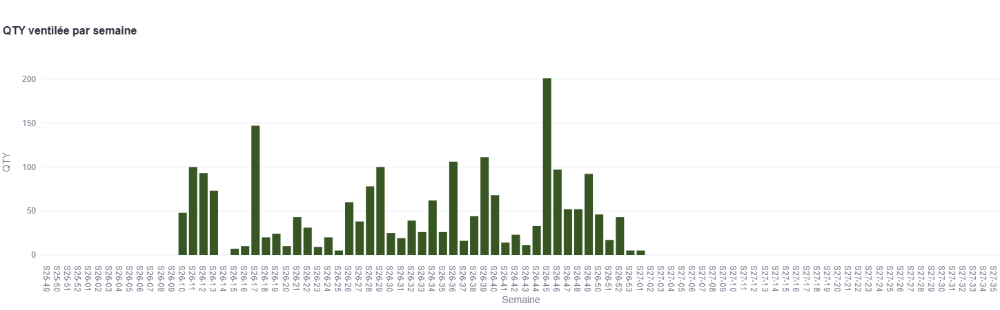
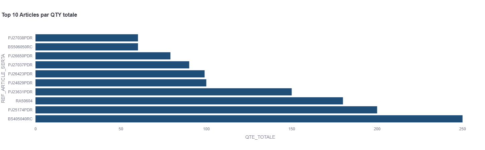

# Previsions SERTA

Interface de visualisation et ventilation des besoins clients.






Quelques visualisations des résultats :





## Flux de données
```
SRV-MSSQLDB (serveur distant)
    └── DW.VENTE.V_LPC              -> previsions LPC par article/semaine
    └── DW.VENTE.V_PRIX_CLIENT_...  -> MOQ / prix par client
    └── DW.PRODUCTION.V_MPS         -> horizon MPS par article
    └── COMMON.USR.V_CALENDAR       -> calendrier des lundis

        ↓  OPENQUERY via serveur lie

DW25 / master.dbo
    └── P_R_PIVOT_PREVISION_DEV_LOCAL
            - charge les donnees distantes dans des tables temporaires
            - calcule la ventilation MOQ/UC semaine par semaine (recursion CTE)
            - gere les cutoffs retard / en cours
            - pivote le resultat en colonnes semaines (S26-09, S26-10, ...)

        ↓  SQLAlchemy (trusted connection)

interface.py  →  Streamlit  →  navigateur
```

## Logique de ventilation

Pour chaque article, la quantite LPC est distribuee sur les semaines futures selon :

- QTE_LOT = MAX(MOQ, UC) si source = MOQ, sinon UC
- QTE_BY_WEEK = part hebdomadaire entiere
- RESTE_NON_UC = reste non divisible par lot
- Recursion CTE sur le calendrier pour propager les quantites semaine par semaine
- COUNT_WK = nombre de semaines entre deux plages LPC (= 1 si plages consecutives)

## Installation

    git clone https://github.com/malek-lab/previsions.git
    cd previsions
    python -m venv venv
    .\venv\Scripts\Activate.ps1
    pip install streamlit pandas sqlalchemy pyodbc plotly openpyxl

## Lancer l'application

    .\venv\Scripts\Activate.ps1
    streamlit run interface.py

L'app est accessible sur http://localhost:8501.

## Parametres de la procedure SQL

| Parametre              | Description                                      |
|------------------------|--------------------------------------------------|
| @SERVEUR_LIE           | Nom du serveur lie (ex: SRV-MSSQLDB)             |
| @FPC_ID                | ID(s) du/des programme(s), separes par virgule   |
| @DATE_DEBUT_PREVISION  | Date de reference pour le calcul du cutoff       |
| @DATE_DEBUT_VENTILATION| Lundi a partir duquel ventiler les quantites     |
| @SOURCE_QTE_LOT        | 1 = MAX(MOQ, UC), 0 = UC seul                    |

## Mettre a jour le depot

    .\venv\Scripts\Activate.ps1
    git status
    git add interface.py
    git commit -m "description de la modification"
    git push

## Structure du projet

    previsions/
    ├── interface.py        # application Streamlit
    ├── Serta_logo.jpg      # logo affiche dans la sidebar
    ├── README.md           # cette documentation
    └── .gitignore          # fichiers exclus du depot
@ | Out-File -FilePath README.md -Encoding utf8
