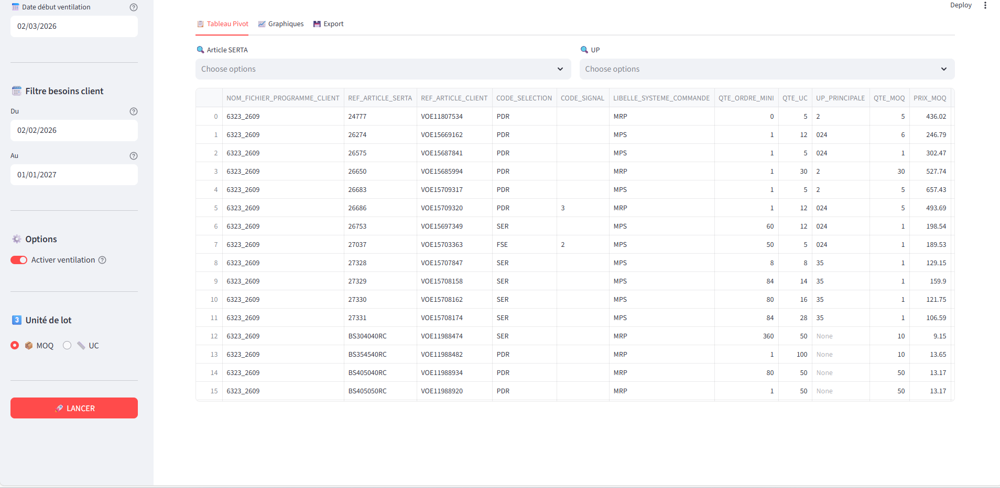

# Previsions SERTA

Interface de visualisation et ventilation des besoins clients.





Quelques visualisations des résultats :


---

## Prérequis

- Python 3.10+
- ODBC Driver 17 for SQL Server ([télécharger](https://learn.microsoft.com/fr-fr/sql/connect/odbc/download-odbc-driver-for-sql-server))
- Accès réseau au serveur `W25-DWDI` (base `master`)
- Accès serveur lié `SRV-MSSQLDB` (base `DW`)

---

## Installation

1. Cloner le repo :
```bash
git clone https://github.com/ton-user/ton-repo.git
cd ton-repo
```

2. Double-cliquer sur `install.bat` — crée le virtualenv et installe les dépendances.

3. Copier `.env.example` en `.env` et renseigner les paramètres de connexion :
```
SERVER=W25-DWDI
DATABASE=master
```

---

## Lancement

Double-cliquer sur `run.bat` — l'interface s'ouvre automatiquement dans le navigateur sur `http://localhost:8501`.

---

## Architecture

```
projet-automatisation/
├── app.py                        # Point d'entrée Streamlit
├── shared.py                     # Connexion SQL, fonctions partagées
├── pages/
│   ├── 01_pivot.py               # Ventilation des programmes LPC
│   ├── 02_supply_chain.py        # Carnet de commande ferme
│   ├── 03_agregation.py          # Agrégation LPC + Carnet
│   ├── 04_consolide.py           # Consolidée par référence
│   └── 05_nouveaux_projets.py    # Intégration PIC nouveaux projets
├── requirements.txt
├── .env.example
├── install.bat
└── run.bat
```

---

## Flux de données

```
01_pivot.py
  └── Procédure SQL P_R_PIVOT_PREVISION_DEV_LOCAL
      → df_pivot (session) — ventilation LPC par semaine ISO

02_supply_chain.py
  └── Vue V_SUPPLY_CHAIN
      → df_sc (session) — carnet de commande ferme

03_agregation.py
  └── df_pivot + V_SUPPLY_CHAIN
      → df_03 (session) — LPC + refs carnet non couvertes par LPC

04_consolide.py
  └── df_03 + df_projets_a_integrer
      → 1 ligne par REF_ARTICLE_SERTA — somme toutes origines

05_nouveaux_projets.py
  └── Vue V_NOUVEAUX_PROJETS
      → df_projets_a_integrer (session) — projets PIC ventilés
```

---

## Vues SQL nécessaires (base master)

| Vue / Procédure | Description |
|---|---|
| `dbo.Programme_VW` | Liste des programmes LPC avec CLI_CODE, FPC_ID, horizon |
| `dbo.V_SUPPLY_CHAIN` | Carnet de commande ferme via OPENQUERY SRV-MSSQLDB |
| `dbo.V_NOUVEAUX_PROJETS` | Projets business PIC (statuts 4/5/6, COS_ID=15) |
| `dbo.P_R_PIVOT_PREVISION_DEV_LOCAL` | Procédure de ventilation LPC par semaine ISO |

---

## Pages

### 📊 Pivot Prévision
Sélection des programmes LPC (un ou plusieurs via filtre par période), ventilation des besoins par semaine ISO. Export CSV/Excel.

### 🔗 Supply Chain
Visualisation du carnet de commande ferme depuis `V_SUPPLY_CHAIN`. Agrégation par semaine ISO sur `CLIENT_ACK_DATE`.

### 📦 Agrégation LPC + Carnet
Fusionne le LPC avec les lignes du carnet dont le couple `CODE_CLIENT | REF_ARTICLE_SERTA` n'est pas couvert par un programme LPC. Export CSV/Excel.

### 📊 Consolidée
Groupby par `REF_ARTICLE_SERTA` — somme toutes origines (LPC, CARNET, PROJET). Colonne `ORIGINE` indique la source : `LPC`, `CARNET`, `PROJET` ou combinaisons `LPC / CARNET`, `LPC / PROJET` etc. Filtres sur Ref, UP, Programme, Origine. Export CSV/Excel.

### 🚀 Nouveaux Projets
Chargement depuis `V_NOUVEAUX_PROJETS`, ventilation mensuelle selon logique PIC (paliers 0/6/12/18 mois, lissage <50/50-199/≥200). Intégration dans la Consolidée avec fusion des quantités sur les refs existantes.

---

## Logique métier clé

**Cutoff LPC** — la procédure `P_R_PIVOT_PREVISION_DEV_LOCAL` calcule une fenêtre `DATE_BORN_GAUCHE / DATE_BORN_DROIT` selon l'écart entre la date d'import du programme et la date de prévision. Les quantités passées sont réallouées sur les semaines futures.

**Comparaison LPC / Carnet** — `CLI_CODE` (V_LPC via Programme_VW) = `SERTA_SO_CLIENT_CODE` (V_SUPPLY_CHAIN) — même référentiel BaaN. Comparaison sur couple `CODE_CLIENT | REF_ARTICLE_SERTA` avec normalisation `zfill(4)`.

**Ventilation projets PIC** — reproduit la logique de `P_R_PIC` : décalage depuis aujourd'hui vers `DATE_DEBUT_SERIE_CALC`, répartition mensuelle lissée, placement sur première semaine complète du mois.

---

## Dépendances principales

```
streamlit
pandas
sqlalchemy
pyodbc
plotly
openpyxl
python-dotenv
```

---

## Auteur

Malek Saidi — automatisation prévisions, Serta Group, 2026.